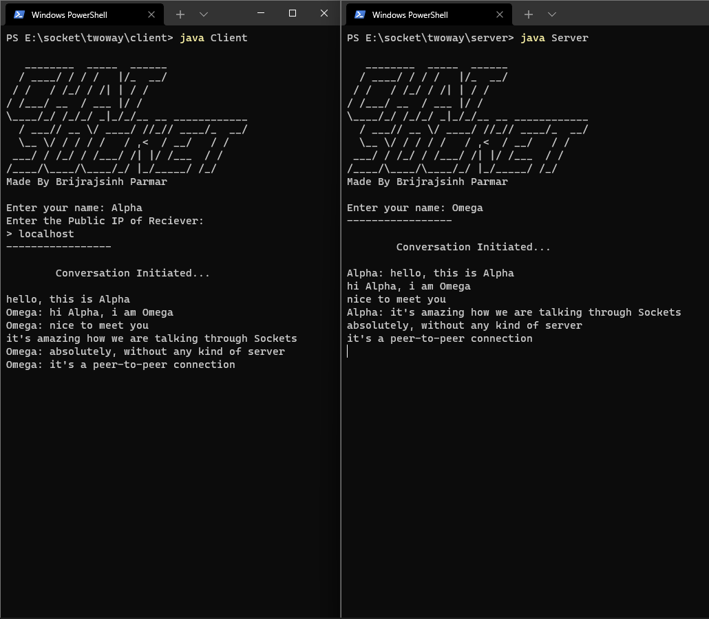

# ChatSocket
## _A Decentralised Chat App Made possible with Sockets Written in JAVA_

A network socket is a software structure within a network node of a computer network that serves as an endpoint for sending and receiving data across the network.

## Screenshots


## How it works?
- ✨Magic ✨

## Features

- Decentralised
- Peer to Peer
- Secure as Heck
- Leightweight
- Better texting than Whatsapp prolly.

## What i used

- sOcKeTs
- Threading
- Streams
- Exception handeling
- google to Find Public IP?
- my two braincells left.


## Installation

requires JDK to run. (obviously duh)

For Client

```sh
javac Client.java
java Client
```

For Server

```sh
javac Server.java
java Server
```

## IMPORTANT

Everything is in code folder.

Keep Client and Server files away from each other if you are trying this out on localhost, the class names are same so while compiling the class files will be replaced by Client or Server depending on which you compile after which, keeping both files in seperate folders (like they are rn) eliminates this

>but brij you should have renamed the classes to avoid this conflicts and why are there two files even? you could have surely filtered it into a singular file for Server and Client Both.

well....

>my answer: it is what it is.
i made this in a hurry and i dont feel like doing it now, but hey, you can always do it yourself, dont forget to make a pull request. (lol)

## I still dont understand how to make this work

Basically
one PC will run Client File, another will run the Server File.
(or not you can run both on same PC in different Terminals to have Fun)

you'll need the Public IPv6 of the PC running Server, it's needed to establish a Socket connection.
remember, P U B L I C - I P v 6
it'll ask you for it when you run Client Program.
it should also have worked for IPv4 but for some reason it doesn't, meh. 

if you're running this on same PC just give `localhost` as IP.

<br><br>
Made with Sheer Agony and Distaste for the world ❤ by Brijrajsinh Parmar